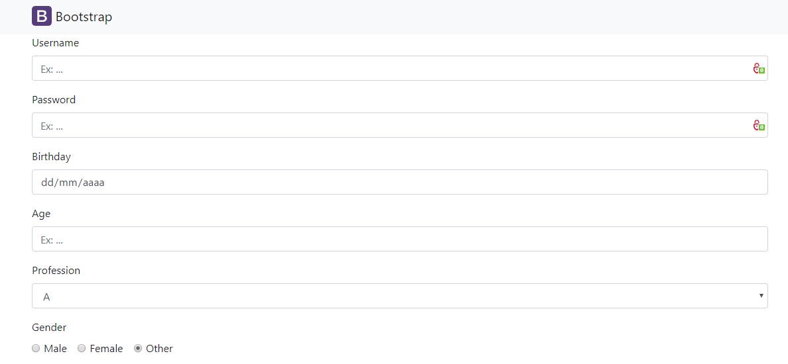

# Bootstrap-EJS Form Builder

This script take an input defined in a excel file and generate a form using Bootstrap.

It's mandatory review the code generated before put in production but this is faster than write everything from scratch.


## How to use

1. Edit `/intput/form.xlsx` file using you favorite spreadsheet software

   

2. Run on terminal:

   ``````bash
   node form.js <input_file> <output_path>
   ``````

   The default input file is `./input/forms.xlsx` and the default output path, where generated html forms will be stored, is `./output/`

   The name for each file generated will be the sheet name of input file.

   

   

3. Review the generated file on `/output/form.ejs`

``````html
<div class="form-group">
  <label for="username">Username</label>
  <input type="text" id="username" name="username" class="form-control" placeholder="Ex: ..." onchange="montarReq(this,false)" required />
</div>

<div class="form-group">
  <label for="password">Password</label>
  <input type="password" id="password" name="password" class="form-control" placeholder="Ex: ..." onchange="montarReq(this,false)" />
</div>

<!-- ...
``````

